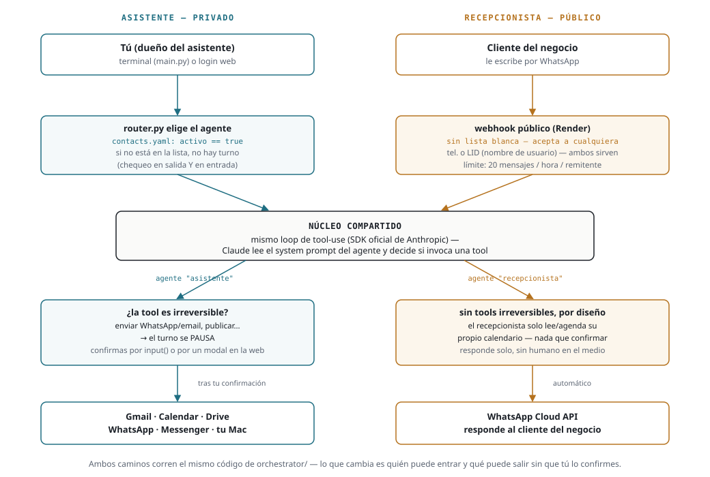

# Arquitectura

Un mismo núcleo (`orchestrator/`) sirve dos productos con reglas de
confianza opuestas: el **asistente** actúa en tu nombre frente a gente que
tú aprobaste; el **recepcionista** actúa en nombre de un negocio frente a
desconocidos. La diferencia entre ambos no es de código — es de quién
puede entrar y qué puede salir sin que un humano lo confirme.

## Componentes

| Componente | Dónde corre | Tecnología |
|---|---|---|
| Orquestador (el "cerebro") | Ambos despliegues | Python + SDK oficial de Anthropic (`anthropic`), loop de tool-use manual, multi-agente con enrutamiento automático (ver `orchestrator/agents/` y `orchestrator/router.py`) |
| Agente "asistente" | Tu Mac / Render (web) | Redacta, agenda y envía — con lista blanca y confirmación humana (`orchestrator/agents/personal_assistant.py`) |
| Agente "ceo" | Tu Mac / Render (web) | Análisis puro, sin tools (`orchestrator/agents/ceo_analyst.py`) |
| Agente "recepcionista" | Render (webhook) | Representa a UN negocio cliente, configurable por `config/negocio.yaml`, sin tools irreversibles (`orchestrator/agents/receptionist.py`) |
| Gmail / Calendar / Drive | Google API oficial (OAuth) | `orchestrator/tools/google_workspace.py` |
| WhatsApp | WhatsApp Cloud API (Meta, oficial) | `orchestrator/tools/whatsapp_cloud_api.py` (+ `whatsapp.py` para la lista blanca del asistente) |
| Messenger | Meta Messenger Platform (oficial, solo Páginas) | `orchestrator/tools/messenger.py` |
| Acciones en Mac | Tu Mac | AppleScript / Shortcuts CLI (`mac-bridge/`) — solo disponible cuando el asistente corre localmente |
| Memoria de estilo | Local / Render | LanceDB (vectorial), respaldo opcional a Drive |
| Ventana de 24h de WhatsApp | Local / Render | `orchestrator/memory/inbound_tracker.py` — registra el último mensaje entrante por remitente, lo usan tanto el asistente como el recepcionista |
| Web del asistente (acceso remoto, por invitación) | Render | `orchestrator/web/` — mismo cerebro, expuesto por HTTP |
| Webhook del recepcionista (público) | Render | `orchestrator/webhooks/whatsapp_cloud.py` — recibe cualquier mensaje de WhatsApp dirigido al negocio |

## Dos niveles de confianza, no dos copias del código

Ambos productos corren el mismo loop de tool-use — lo que cambia es la
puerta de entrada y la puerta de salida:

- **Asistente** (privado): solo atiende a quien esté en
  `config/contacts.yaml` con `activo: true`, y cualquier tool
  irreversible (enviar WhatsApp/email/Messenger) pausa el turno y pide tu
  confirmación explícita antes de ejecutar.
- **Recepcionista** (público, por diseño): no tiene lista blanca —
  cualquiera que le escriba al número del negocio es exactamente el caso
  de uso. En su lugar, `orchestrator/webhooks/whatsapp_cloud.py` aplica un
  límite de 20 mensajes/hora por remitente contra abuso. No hace falta un
  gate de confirmación humana porque el agente "recepcionista" no tiene
  **ninguna** tool irreversible (ver `TOOLS_IRREVERSIBLES` en
  `receptionist.py`): en el peor caso lee o agenda el propio calendario
  del negocio.

Exigir lista blanca en el webhook del recepcionista rompería el producto
— existe justamente para atender gente que el negocio todavía no conoce.

## Lista blanca de contactos (solo aplica al asistente)

`orchestrator/contacts.py` es la única fuente de verdad de a quién puede
hablarle el **asistente** y de quién puede aceptar mensajes suyos. Se
aplica en dos puntos:

- **Salida**: cada tool de canal (`tools/whatsapp.py`,
  `tools/google_workspace.py`, `tools/messenger.py`,
  `tools/macos_actions.py`) llama a `contacts.verificar_autorizado(...)`
  antes de enviar nada. Si el destinatario no está en
  `config/contacts.yaml` con `activo: true`, el envío se rechaza
  (`status: "rechazado"`) sin tocar la red.
- **Entrada**: el enrutador (`router.py`) solo le pasa el turno al agente
  "asistente" cuando el remitente está autorizado.

Administra la lista con `python scripts/manage_contacts.py` (ver
`MANUAL_CONEXION.md` sección 0.5). El archivo real (`config/contacts.yaml`)
nunca se sube a git — solo la plantilla `contacts.yaml.example`.

## Flujo de un mensaje (asistente)

1. Escribes algo — por terminal (`main.py`) o por la web (`web/app.py`).
2. El enrutador (`router.py`, Claude Haiku 4.5) decide qué agente atiende:
   "asistente" para tareas operativas, "ceo" para análisis puro.
3. El agente arma el prompt con: la instrucción, la fecha/hora actual
   (`agents/base.py`), y memoria de estilo si vas a redactar algo.
4. Claude decide si necesita una tool (`enviar_whatsapp`, `crear_evento_calendario`,
   `abrir_app_o_archivo_mac`, etc.) y la invoca.
5. **Si la acción es irreversible** (enviar WhatsApp/email/Messenger) el
   asistente muestra el borrador y espera tu confirmación explícita antes
   de ejecutar — por `input()` en terminal, por un modal en la web. Esto
   está reforzado en `orchestrator/main.py` / `orchestrator/web/app.py` —
   no lo quites.

## Flujo de un mensaje (recepcionista)

1. Un cliente del negocio le escribe al número de WhatsApp del negocio.
2. Meta llama al webhook (`orchestrator/webhooks/whatsapp_cloud.py`,
   desplegado en Render). El remitente puede venir como número de
   teléfono o como identificador opaco (LID) si tiene activado el
   "nombre de usuario" en WhatsApp — el código acepta cualquiera de los
   dos, de punta a punta.
3. Si el remitente no superó el límite de mensajes/hora, se registra en
   `inbound_tracker` y se dispara el mismo tipo de loop de tool-use que
   el asistente, pero con el agente "recepcionista" y su system prompt
   armado desde `config/negocio.yaml` (nombre, horario, servicios, FAQ,
   a qué se deriva a un humano).
4. Como el agente no tiene tools irreversibles, la respuesta se envía de
   inmediato por `whatsapp_cloud_api.enviar(...)` — sin humano en el
   medio.

Onboardear un negocio cliente nuevo es escribir su `config/negocio.yaml`
(o el `NEGOCIO_YAML` del Environment Group en Render) — nunca hace falta
tocar código.

## Despliegue

Ya no es un proyecto "solo local": hay dos servicios independientes en
Render (ver la tabla de Componentes arriba y el README, sección
Despliegue), cada uno con su propio comando de arranque y sus propias
variables de entorno. Tu Mac sigue siendo necesaria solo para
`macos_actions.py` (AppleScript/Shortcuts) y para correr `main.py` por
terminal — el resto (Gmail/Calendar/Drive, WhatsApp, Messenger, la web del
asistente y el webhook del recepcionista) funciona igual desplegado.

## Versión web del asistente (acceso remoto, solo por invitación)

`orchestrator/web/` expone el mismo cerebro (agentes + `router.py`) por
HTTP en vez de por terminal, para no quedar atado a tu Mac. Login con
Google restringido a `config/invited_users.yaml` (lista aparte de
`config/contacts.yaml` — una controla quién puede *usar el chat*, la otra
a quién puede el asistente *contactar*). La única diferencia real de
comportamiento frente a `main.py`: cuando una tool es irreversible, el
turno no bloquea en `input()` — se pausa y el frontend muestra un modal
de confirmar/cancelar (`orchestrator/web/app.py` función
`_correr_turno_web`, endpoint `POST /api/chat/confirmar`).

## ⚠️ Advertencia de diseño: WhatsApp y Messenger personales

No existe una API oficial de Meta para automatizar **tu cuenta personal**
de WhatsApp o Messenger actuando exactamente como tú — solo la vía oficial
(WhatsApp Business API / Meta Messenger Platform), que identifica al
remitente como una "empresa/página", no como tú. Este proyecto usa
deliberadamente solo esa vía oficial (`tools/whatsapp_cloud_api.py`,
`tools/messenger.py`) — se descartó la alternativa no oficial (Baileys)
para simplificar y evitar el riesgo de baneo que conlleva. Es la misma
vía oficial la que hace posible el recepcionista: un número de WhatsApp
Business puede representar a un negocio sin pretender ser una persona.
